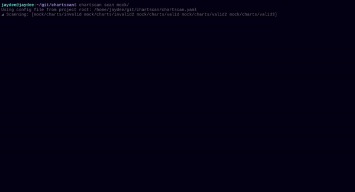

# ChartScan


**ChartScan** is a CLI tool for scanning and analyzing Helm charts. It provides insights into Helm chart configurations, values, and rendering issues, allowing developers to efficiently debug and validate Helm charts before deployment.


---

## Features

- Scans directories for Helm charts.
- Supports multiple values files for rendering charts.
- Configurable output formats: **pretty**, **JSON**, **JUnit**, or **YAML**.
- Supports configuration through YAML-based config files.

---

## Installation

### Precompiled Binaries

For convenience, precompiled binaries are available for the latest releases of **ChartScan**. These binaries are built for multiple architectures and can be directly downloaded from the **Releases** page on GitHub.

To download the latest release:

1. Go to the [ChartScan Releases Page](https://github.com/Jaydee94/chartscan/releases).
2. Download the appropriate binary for your system:
   - **Linux amd64**: `chartscan-amd64`
   - **Linux arm64**: `chartscan-arm64`
   - **Linux 386**: `chartscan-386`
3. (Optional) Move the binary to a directory in your system's `PATH`:

   ```bash
   mv chartscan-[architecture] /usr/local/bin/chartscan
   ```

---

## Prerequisites

Ensure the following dependencies are installed:

- **Helm**: [Install Helm](https://helm.sh/docs/intro/install/)

---

## Usage

### Demo



### Commands

#### Scan Command

The `scan` command is used to analyze Helm charts for potential issues:

```bash
chartscan scan [chart-path]
```

### Options for `scan`

- `-f, --values`: Specify values files to use for rendering.
- `-o, --format`: Set the output format (pretty, json, yaml, junit). Default is `pretty`.
- `-c, --config`: Provide a configuration file (YAML format) to override CLI flags.
- `-e, --environment`: (Optional) Specify the environment to use (e.g., test, staging, production). This will load preconfigured values files for the specified environment in chartscan.yaml.

#### Template Command

The `template` command is used to render Helm charts with helm template:

```bash
chartscan template [chart-path]
```

### Options for `template`

- `-f, --values`: Specify values files to use for rendering.
- `-o, --format`: Specify an output file to write the rendered chart (optional).
- `-c, --config`: Provide a configuration file (YAML format) to override CLI flags.
- `-e, --environment`: (Optional) Specify the environment to use (e.g., test, staging, production). This will load preconfigured values files for the specified environment in chartscan.yaml.

#### Version Command

The `version` command displays the current version of ChartScan:

```bash
chartscan version
```

### Examples

#### Scan a Chart Directory with Values Files

```bash
chartscan scan ./charts -f values.yaml -o json
```

#### Use a Config File

```bash
chartscan scan -c config.yaml
```

#### Example Config File

```yaml
chartPath: ./charts
valuesFiles:
  - values.yaml
format: yaml
environments:
  test:
    valuesFiles:
      - values-test.yaml
      - values-2-test.yaml
  staging:
    valuesFiles:
      - values-staging.yaml
  production:
    valuesFiles:
      - values-production.yaml
```

---

## Automatic Config File Loading in Git Repositories

When you run ChartScan inside a Git repository, the tool will automatically search for and load a configuration file located in the root directory of the repository. This behavior eliminates the need to manually specify the config file with the -c option if you already have one in your repository.

How It Works
ChartScan looks for a file named chartscan.yaml in the root directory of the repository.
If the config file is found, ChartScan will automatically load it and use its settings, including chart paths, values files, output format, and more.

This behavior simplifies configuration management, especially for projects with shared settings across team members.
Example: Automatic Config Loading
For example, if your Git repository has the following directory structure:

```
my-repo/
├── chartscan.yaml
├── charts/
│   └── my-chart/
├── values.yaml
└── README.md
```

When you run (inside a git repo with a chartscan.yaml in the root directory):

```bash
chartscan scan ./charts
```

ChartScan will automatically detect and use chartscan.yaml for its configuration.

---

## Output Formats

- **Pretty**: Human-readable formatted output.
- **JSON**: Machine-readable JSON format.
- **YAML**: YAML-encoded output for further processing.
- **JUnit**: JUnit-compatible XML format for test reports.

---

## Development

### Running Locally

1. Clone the repository.
2. Install dependencies:

   ```bash
   go mod tidy
   ```

3. Run the tool:

   ```bash
   go run main.go [command] [options]
   ```

### Testing

Run the test suite:

```bash
go test ./...
```

---

## Contribution

Contributions are welcome! Please follow these steps:

1. Fork the repository.
2. Create a feature branch (`git checkout -b feature-name`).
3. Commit your changes (`git commit -m "Add feature"`).
4. Push to the branch (`git push origin feature-name`).
5. Open a pull request.
